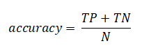
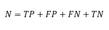
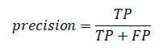
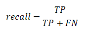
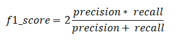
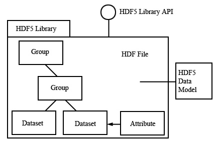

 **PCAM DATASET AND TRAIN MODEL**

------------

**ЛАБОРАТОРНЫЕ РАБОТЫ ПО КУРСУ**

**«МЕТОДЫ ГЛУБОКОГО ОБУЧЕНИЯ ДЛЯ РЕШЕНИЯ ЗАДАЧ КОМПЬЮТЕРНОГО ЗРЕНИЯ».**

Цель данной лабораторной работы - с помощью нейронных сетей реализовать решение задачи бинарной классификации.

##  1.  Постановка задачи.

Вход сети: трехканальное цветное изображение в формате RGB размерностью 96x96. 

Выход сети: значение, находящееся в пределах [0,1] - вероятность того, что на изображении раковые клетки.

### Обучение на тренировочной выборке
Сеть обучаем определенное количество эпох, то есть полностью проходим по тестовой выборке и делим данные на пакеты.

1. Инициализация весов
2. В каждой эпохе происходит:

- Перемешивание выборки

- Пакетное использование данных

- Корректировка весов по алгоритму обратного распространения ошибки

## 2. Тренировочные и тестовые наборы данных.
В работе используются данные из https://github.com/basveeling/pcam, полученные из гистологических сканирований срезов лимфатических узлов. Каждое изображение помечено бинарной меткой, которая показывает наличие метастатической ткани. Зеленые прямоугольники в центральной области указывают на опухолевую ткань , что является положительной меткой.
> Пример изображений.

Общее количество - 327680 цветных изображений размером
w \* h \* c  = 96 \* 96 \* 3. Изображения, на которых есть признаки рака представлены в количестве 163840, и те, на которых рак не обнаружен - 163840.

| Данные | Количество примеров с раковыми клетками | Количество примеров без раковых клеток |
| ------------ | ------------ | ------------ |
| train | 131072 | 131072 |
| test | 16384 | 16384 |
| valid | 16384 | 16384 |

## 3. Метрика качества решения задачи.

Y - оригинал
U - наш классификатор

|   | Y = TRUE |  Y = FALSE |
| ------------ | ------------ | ------------ |
| **U = TRUE** | True Pos | False Pos |
| **U = FALSE** | False Neg | True Neg |

 - точность классификатора, где

  - качество классификатора

  - полнота классификатора

## 4. Исходный формат хранения данных.
Модель хранения данных: `HDF5 Matrix`.
Представляет из себя иерархическую стурктуру хранения датасетов.

Список используемых файлов в данном формате:

`train_x_name = 'camelyonpatch_level_2_split_train_x.h5'`

`train_y_name = 'camelyonpatch_level_2_split_train_y.h5'`

`test_x_name = 'camelyonpatch_level_2_split_test_x.h5'`

`test_y_name = 'camelyonpatch_level_2_split_test_y.h5'`

`valid_x_name = 'camelyonpatch_level_2_split_valid_x.h5'`

`valid_y_name = 'camelyonpatch_level_2_split_valid_y.h5'`

## 5. Формат, в котором данные предоставляются на вход сети.
Данные необходимо нормализовать, поделив на 255. 
Формат хранения: HDF5 matrix - сжатый формат хранения больших датасетов.

## Реализация
### Внешние зависимости:

|  Библиотека  | Основное назначение |
| ------------ | ------------ |
| google.colab | соединяет с Google Drive |
| tensorflow | backend Keras |
| keras | основной фреймворк для работы с нейронными сетями |
| gzip | архивация данных |
| shutil | обработка файлов и данных |
| pandas | анализ данных |
| matplotlib | визуализация данных |
| cv2 (OpenCV) | библиотека компьютерного зрения |
| numpy | работа с тензорами |
| keras_metrics | работа с метриками |