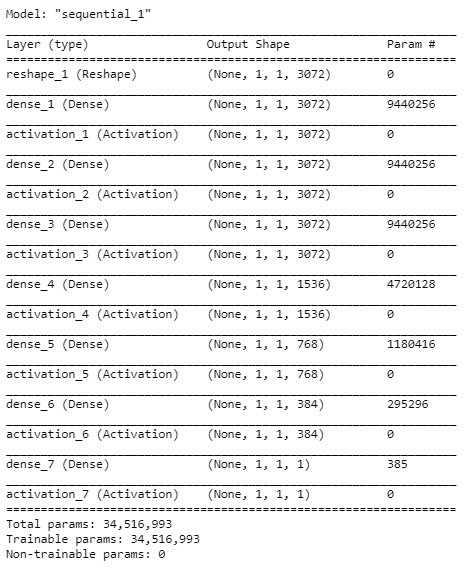
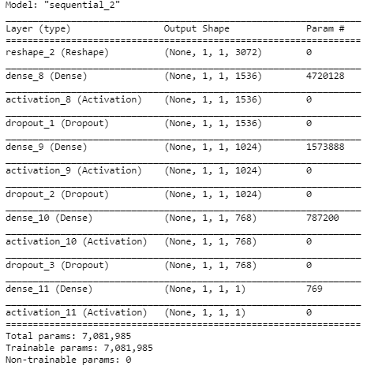
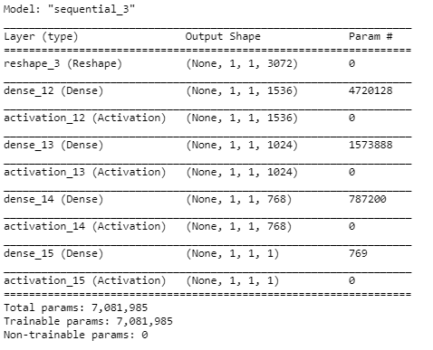
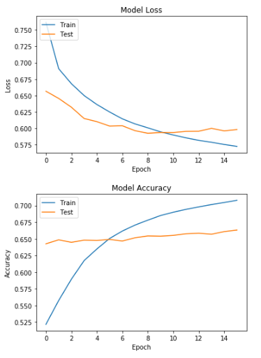
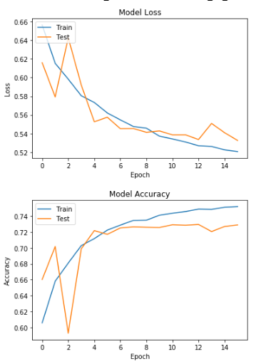

**ПРАКТИЧЕСКАЯ РАБОТА №2**

**РАЗРАБОТКА ПОЛНОСТЬЮ СВЯЗАННЫХ НЕЙРОННЫХ СЕТЕЙ**

Реализация полносвязной нейронной сети FCNN для задачи бинарной классификации.

### 1. Разработанные скрипты.
Реализация в скрипте *pcam_fcn.ipynb*
### 2. Тестовые конфигурации сетей.
- With the same layers

- With dropout

- Without dropout

### 3. Результаты экспериментов.
- With the same layers

|   |  TRAIN  | VALID   | TEST   |
| ------------ | ------------ | ------------ | ------------ |
| ACCURACY   | 76.2062  | 75.1037  | 72.9492  |
| PRECISION  | 77.699  |  78.7681 | 76.9573  |
| RECALL | 73.5115  | 68.6724  | 65.482  |
|  F1-SCORE | 75.5472  |  73.3746 | 70.7574  |
|  TIME  |  25s 97us/step  | 3s 95us/step  |  3s 95us/step |

- With dropout

|   |  TRAIN  | VALID   | TEST   |
| ------------ | ------------ | ------------ | ------------ |
| ACCURACY   | 68.5176  | 68.2586  |  67.2637 |
| PRECISION  | 62.914  | 63.3524  | 62.9622  |
| RECALL | 90.2137  | 86.51 |  83.7882 |
|  F1-SCORE | 74.1303  |  73.1358 |  71.8975 |
|  TIME  |  24s 90us/step  | 3s 89us/step  |  3s 89us/step |

- Without dropout

|   |  TRAIN  | VALID   | TEST   |
| ------------ | ------------ | ------------ | ------------ |
| ACCURACY   | 75.4093 | 73.1414| 70.6939  |
| PRECISION  | 77.1441  | 77.5079  | 75.0926  |
| RECALL | 72.2137  |  65.1353 | 61.8916  |
|  F1-SCORE |  74.5975 | 70.785 |  67.856 |
|  TIME  | 23s 89us/step |  3s 87us/step | 3s 86us/step  |
