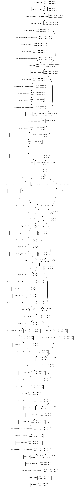
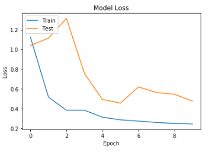
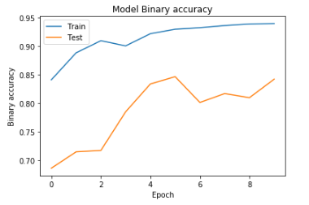
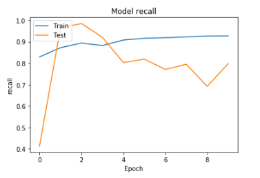
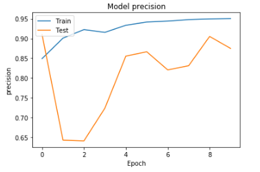

**ПРАКТИЧЕСКАЯ РАБОТА №3**

**РАЗРАБОТКА СВЕРТОЧНЫХ НЕЙРОННЫХ СЕТЕЙ**

Разработана сверточная нейронная сеть CNN для решения задачи бинарной классификации. Проведены эксперименты с разными конфигурациями сверточных нейронных сетей. Собраны результаты качества работы сети.

### 1. Разработанные скрипты.
Реализация в скриптах:

 *pcam_lab_3_part1.ipynb*
 
 
### 2. Тестовая конфигурация сети - ResNet20.

### 3. Результаты экспериментов.

|   |  TRAIN  | VALID   | TEST   | 
| ------------ | ------------ | ------------ | ------------ |
| ACCURACY   | 91.7728 | 86.5203 | 84.201 |
| PRECISION  | 91.7728 | 86.5203 | 84.201 |
| RECALL | 89.5968 | 88.3667 | 87.4983 |
|  F1-SCORE | 94.5205 | 84.0857 | 79.7887 |
| INFERENCE TIME | 2.5min | 25sec | 20sec |
| TRAIN TIME | 1h | - | - |

