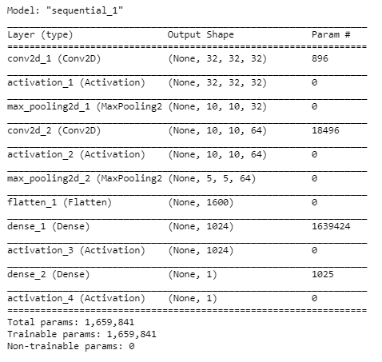
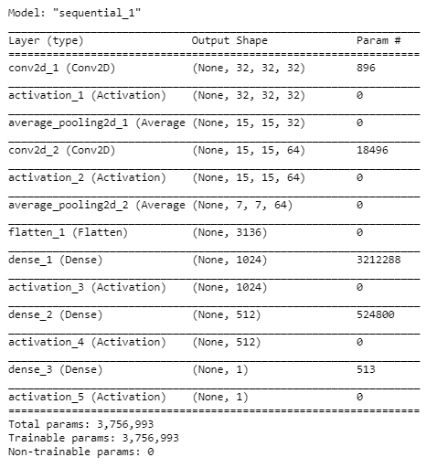
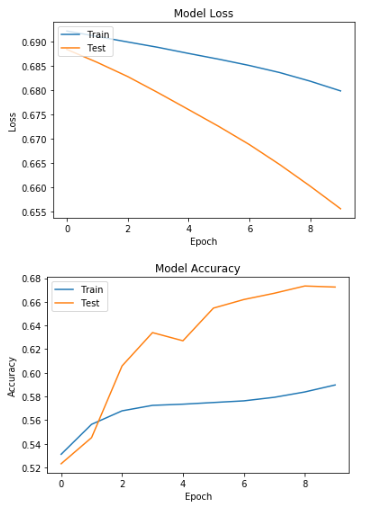

**ПРАКТИЧЕСКАЯ РАБОТА №3**

**РАЗРАБОТКА СВЕРТОЧНЫХ НЕЙРОННЫХ СЕТЕЙ**

Реализация свёрточной нейронной сети CNN для задачи бинарной классификации.

### 1. Разработанные скрипты.
Реализация в скриптах:

 *pcam_cnn_maxpooling.ipynb*

 *pcam_cnn_averagepooling.ipynb*

 

### 2. Тестовые конфигурации сетей.

- Max pooling

- Average pooling

### 3. Результаты экспериментов.

- Max pooling

|   |  TRAIN  | VALID   | TEST   |
| ------------ | ------------ | ------------ | ------------ |
| ACCURACY   | 65.2248 | 67.2546 | 65.7257 |
| PRECISION  | 68.5893 | 70.825 | 69.5933 |
| RECALL | 56.1752 | 58.5802 | 55.8038 |
|  F1-SCORE | 61.7646 | 64.1233 | 61.9404 |
|  TIME  | 43s 5ms/step | 3s 3ms/step  |  3s 3ms/step |

- Average pooling

|   |  TRAIN  | VALID   | TEST   |
| ------------ | ------------ | ------------ | ------------ |
| ACCURACY   | 64.6724 | 65.213 | 66.6748 |
| PRECISION  | 60.9053 | 61.7996 | 61.9101 |
| RECALL | 81.9442 | 79.51 | 86.6031 |
|  F1-SCORE | 69.8755 | 69.545 | 72.2038 |
|  TIME  | 54s 7ms/step | 6s 6ms/step | 6s 6ms/step |
