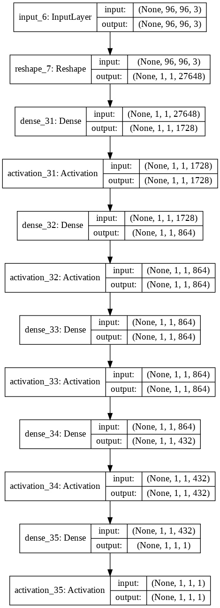
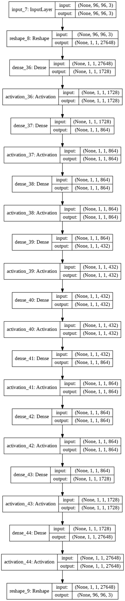
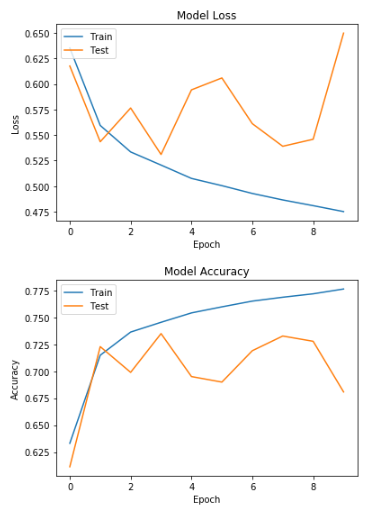
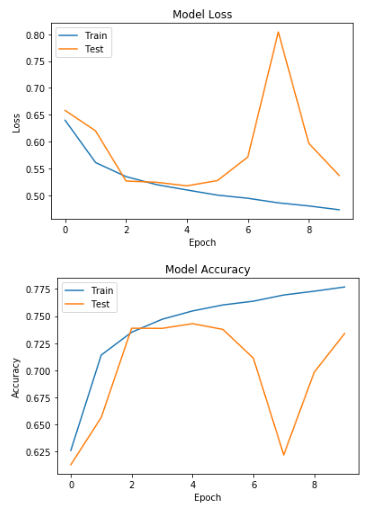

**ПРАКТИЧЕСКАЯ РАБОТА №4**

**НАЧАЛЬНАЯ НАСТРОЙКА ВЕСОВ ПОЛНОСТЬЮ СВЯЗАННЫХ НЕЙРОННЫХ СЕТЕЙ**

Проведена начальная настройка весов разработанных ранее полносвязных нейронных сетей. Проведены эксперименты. Собраны результаты качества работы сети с предварительной настройкой весов.

### 1. Разработанные скрипты.

Реализация в скрипте *pcam_lab_4.ipynb*

### 2. Тестовые конфигурации сетей.

Используем FCNN.

Далее реализуем автокодировщик, основанный на FCNN.

### 3. Результаты экспериментов.

|   | TRAIN FCNN | TRAIN FCNN autocode | VALID FCNN | VALID FCNN autocode | TEST FCNN | TEST FCNN autocode |
| ------------ | ------------ | ------------ | ------------ | ------------ | ------------ | ------------ |
| ACCURACY | 77.2972 | 79.5455 | 71.3562 | 74.4812 | 68.0786 | 73.3856 |
| PRECISION | 81.6264 | 79.9338 | 79.5114 | 78.4642 | 76.893 | 77.378 |
| RECALL | 70.4528 | 78.897 | 57.4683 | 67.4201 | 51.6517 | 66.0621 |
| F1-SCORE | 75.6291 | 79.412 | 66.7163 | 72.5241 | 61.7941 | 71.2737 |
| INFERENCE TIME | 60sec | 78sec | 25sec | 9sec | 8sec | 9sec |
| TRAIN TIME | 9min | 10min | - | - | - | - |

- FCNN

- FCNN autocode

