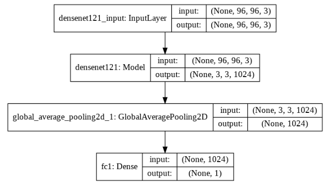
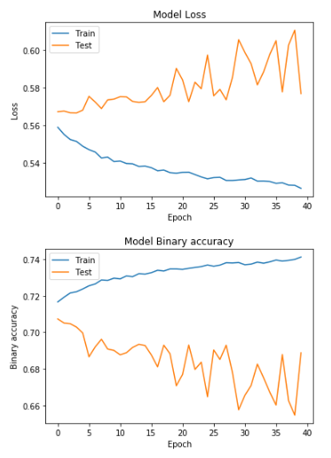
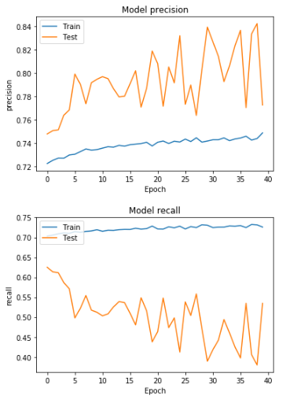
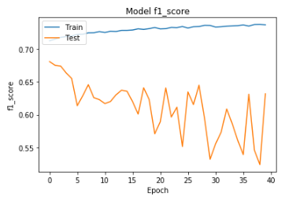
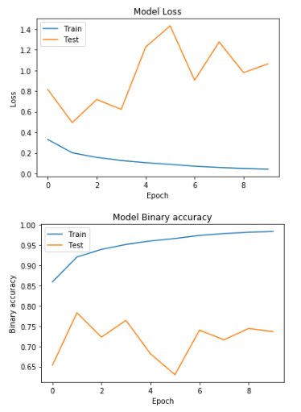
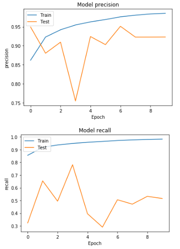
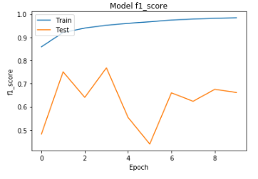
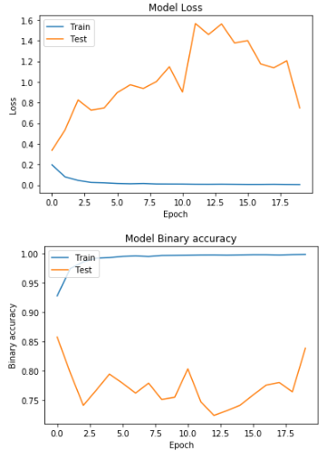
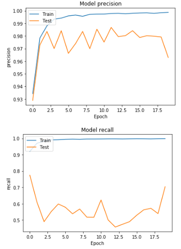
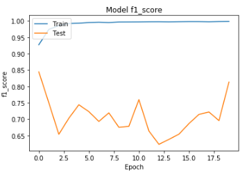

**ПРАКТИЧЕСКАЯ РАБОТА №5**

**ПЕРЕНОС ОБУЧЕНИЯ ГЛУБОКИХ НЕЙРОННЫХ СЕТЕЙ**

Применен перенос обучения для решения задачи, поставленной в ходе второй практической работы. Проведены эксперименты с сетями, существующими для решения классических задач. Собраны результаты качества работы сетей с предварительной настройкой весов.

### 1. Разработанные скрипты.

Реализация в скриптах 

*pcam_lab_5_densnet_fixed.ipynb*

*pcam_lab_5_densnet_from_scratch.ipynb*

*pcam_lab_5_densnet_retrain.ipynb*

### 2. Тестовые конфигурации сетей.

- Выбрана модель DenseNet121, которая обучена на данных ImageNet. Был удален классификатор и проведена тренировка нового классификатора на признаках, построенных с использованием начальной части сети.

- Выбрана модель DenseNet121 на случайно инициализированных весах и выполняется обучение.

- Выбрана модель DenseNet121, произведена замена классификатора и полученная модель обучается как единая система.

### 3. Результаты экспериментов.

|   | TRAIN Freeze weights | TRAIN From Scratch | TRAIN Tuning weights | VALID Freeze weights | VALID From Scratch | VALID Tuning weights | TEST Freeze weights | TEST From Scratch | TEST Tuning weights |
| ------------ | ------------ | ------------ | ------------ | ------------ | ------------ | ------------ | ------------ | ------------ | ------------ |
| ACCURACY | 70.0065 | 85.0341 | 97.6711 | 63.6444 | 75.6103 | 82.7331 | 68.8751 | 73.6358 | 83.847 |
| PRECISION | 78.7608 | 96.2343 | 98.7714 | 75.3009 | 92.7005 | 95.8793 | 77.2735 | 92.3026 | 96.2913 |
| RECALL | 54.7874 | 72.9217 | 96.5431 | 40.5094 | 55.5501 | 68.3731 | 53.4408 | 51.5479 | 70.3914 |
| F1-SCORE | 64.6223 | 82.9716 | 97.6445 | 52.6792 | 69.4705 | 79.8231 | 63.1844 | 66.152 | 81.3291 |
| INFERENCE TIME | 241sec | 248sec | 242sec | 31sec | 32sec | 32sec | 30sec | 31sec | 30sec |
| TRAIN TIME | 1h 32min | 1h 8min | 2h 14min | - | - | - | - | - | - |

- Freeze weights

- From Scratch

- Tuning weights

